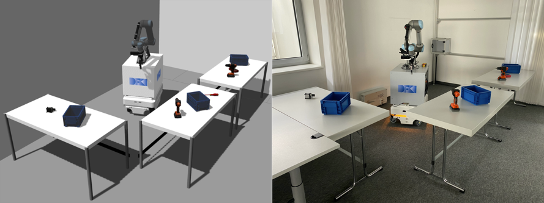

mobipick_labs
=============

Scenario description
--------------------



The tables demo consists of an environment with items on multiple tables, in which the robot shall

- find the box and place it onto the target table,
- find the multimeter and place it into the box,
- in any order,
- and react to changes to the environment, e.g. items being moved around during the demo.

For details about the DFKI internal event at which this demo was presented,
see this [wiki page](https://git.ni.dfki.de/mobipick/documentation/-/wikis/Mobipick-tables-demo).

Installation
------------

This demo might install a lot, depending on what you already have on your
system. Your catkin workspace for [mobipick](https://git.ni.dfki.de/mobipick/mobipick),
if you don't mind adding further repositories, or a new catkin workspace with only this
repository is recommended to start with. [vcs](https://pypi.org/project/vcstool/) and
[wstool](http://wiki.ros.org/wstool) will be installed when needed,
ROS and Python 3 are assumed to be available on your system.

```bash
./install-deps.sh
./build.sh
```

Real robot demo
---------------

Start up the robot according to the (DFKI internal) [instructions on the
wiki](https://git.ni.dfki.de/mobipick/documentation/-/wikis/starting-up-the-robot),
then:


```bash
roslaunch mobipick_bringup mobipick_bringup_both.launch  # already part of the startup instructions
roslaunch pbr_dope dope.launch
roslaunch tables_demo_bringup bringup.launch
```

To start the full tables demo, then run:

```bash
rosrun tables_demo_planning tables_demo_node.py  # optional: <number of target table>, e.g., "4"; default: 2
```

To start the power drill pick&place demo, run:

```bash
rosrun tables_demo_planning pick_n_place_demo_node.py
```

Optionally, for making the robot speak, run this command on a PC with a speaker (e.g., your laptop):

```bash
rosrun espeak_ros espeak_node
```

Optionally for visualization:

```bash
rosrun rviz rviz -d `rospack find tables_demo_bringup`/config/pick_n_place.rviz __ns:=mobipick
```

Gazebo demo
-----------

```bash
roslaunch tables_demo_bringup demo_sim.launch
rosrun tables_demo_planning tables_demo_node.py
```

The optional components above for speaker and visualization work in simulation as well.

Grasping/Placing/Inserting objects demo (using grasplan)
--------------------------------------

Goal of the robot in this demo is to

- test grasplan
- grasp multiple objects in simulation
- useful for debugging

```bash
roscore
roslaunch tables_demo_bringup demo_sim.launch robot_x:=12.43 robot_y:=2.21 robot_yaw:=1.5708
rosrun rviz rviz -d `rospack find tables_demo_bringup`/config/pick_n_place.rviz __ns:=mobipick
```

Pick

```bash
rosrun grasplan pick_obj_test_action_client __ns:=mobipick power_drill_with_grip table_1
```

Optionally you can specify a list of objects to ignore/delete from planning scene. This will allow e.g. to pick
a box with objects inside it. To run do:

```bash
rosrun grasplan pick_obj_test_action_client __ns:=mobipick power_drill_with_grip table_1 object_to_ignore_1 object_to_ignore_2 ...
rosrun grasplan pick_obj_test_action_client __ns:=mobipick klt table_1 multimeter_1
```

Place

```bash
rosrun grasplan place_obj_test_action_client __ns:=mobipick table_3 true
```

Insert

```bash
rosrun grasplan insert_obj_test_action_client __ns:=mobipick klt_3 true
```

If you want to grasp the other objects you can use the following robot pose.

```bash
roslaunch tables_demo_bringup demo_sim.launch robot_x:=10.46 robot_y:=2.47 robot_yaw:=3.1415
```

If you want to grasp another object after picking, please place the object first.


Pick-and-place demo on the real robot
-------------------------------------

Goal of the robot in this demo is to

- fetch the power drill from the table,
- hand it over to a person,
- return empty-handed to its home position.

```bash
roslaunch mobipick_bringup mobipick_bringup_both.launch
roslaunch pbr_dope dope.launch
roslaunch mobipick_pick_n_place mobipick_pick_n_place.launch world:=moelk_tables_demo
rosservice call /mobipick/continue_statemachine
```


Pick-and-place demo (using plexmo)
----------------------------------

An alternative version of this demo exists which makes use of the generic plan
execution and monitoring module
[plexmo](https://github.com/aiplan4eu/embedded-systems-bridge/tree/master/up_esb/plexmo).

This demo can either be run on the real robot like this:

```bash
roslaunch mobipick_bringup mobipick_bringup_both.launch
roslaunch pbr_dope dope.launch
rosrun tables_demo_planning uplexmo_pick_n_place_demo_node.py
```

... or in Gazebo like this:

```bash
roslaunch tables_demo_bringup demo_sim.launch
rosrun tables_demo_planning uplexmo_pick_n_place_demo_node.py
```

When running in Gazebo, run the following as soon as the robot has reached the "handover" pose:

```bash
rosservice call /mobipick/simulate_user_interaction before the timeout
```

This will cause the robot to open its gripper, since we simulated a user
holding the power drill with the command above. Since nobody is actually
holding the power drill in Gazebo, it will drop to the floor. Since the robot
cannot detect this, it will assume that the handover was successful and
continue with the demo.

If no `simulate_user_interaction` command is given within a timeout of 30
seconds, plan execution will fail (as expected, since the handover was
unsuccessful).


Plan visualization
------------------

Install and source the
[dot_graph_visualization](https://github.com/DFKI-NI/dot_graph_visualization)
rqt plugin, then call it with:

```bash
rqt --standalone dot_graph_visualization
```

pre-commit Formatting Checks
----------------------------

This repo has a [pre-commit](https://pre-commit.com/) check that runs in CI.
You can use this locally and set it up to run automatically before you commit
something. To install, use pip:

```bash
pip3 install --user pre-commit
```

To run over all the files in the repo manually:

```bash
pre-commit run -a
```

To run pre-commit automatically before committing in the local repo, install the git hooks:

```bash
pre-commit install
